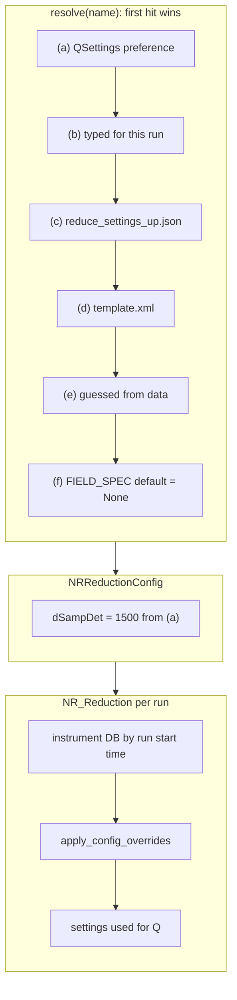
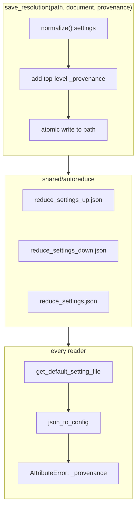

# Advisor note — `settings-management` (T3) v1: how the two human-routed flags manifest (2026-09-10)

Written for the human's decision on the Integrator's C4 (layer (a) outranks
the measurement) and C2a (`save_resolution` writes a file the readers refuse),
`todo.md` @ `6365df4`. Both are traced through the code on `exp` @ `6da473d`
and the delivered resolver @ `0fe640d`. Both are **latent today** only because
nothing in the shipped launcher calls the resolver yet (C1); the moment v2
wires it, each becomes live.

## 1. Layer (a) outranks the measurement (C4)

The resolver walks six layers in a fixed order and the first non-empty one
wins. Layer (a) is the new "Global reduction settings" dialog, persisted in
QSettings, so it survives across sessions, experiments and months. The
delivered whitelist is derived by field *group* and includes the whole
instrument-geometry group.

Node detail:

- **The walk.** `settings_resolver.py:174-175` checks `global_settings`
  before `ui_overrides`, then the JSON file, then the template, then the
  dataset probe, then the default. A value in (a) is never consulted against
  anything below it.
- **Geometry fields are "unset means measured."** `mmpix`, `dSampDet`,
  `dMod`, `xi_ref`, `dS1Samp`, `nx`, `ny` and `IncidentTheta` all default to
  `None`, and their own help text (`field_spec.py:514-533`) says *"Unset reads
  it from the instrument settings."* That is the instrument's answer, indexed
  by the run's start time through `tools.read_settings`
  (`nr_reduction_calc.py:376`).
- **The override path.** `apply_config_overrides` (`nr_reduction_calc.py:1145`)
  copies any non-`None` config geometry value over the instrument settings.
  So a preference becomes a config value, which becomes an instrument
  override, which changes Q for every run reduced in that session.

**The scenario.** A scientist sets a sample-detector distance in the global
dialog once, during a commissioning week when the instrument DB was stale.
It persists. Months later a different experiment loads
`reduce_settings_up.json` from its own `shared/autoreduce`, which carries no
geometry — exactly as intended, because geometry should come from the
instrument. The resolver fills those fields from the stale preference. The
badge says `[a]` in the editor tab, but the reduced R(Q) written to the
experiment's folder now differs from what the autoreduction produced from
the identical file. Two people with the same UI and the same file get
different data, and the file cannot show why.

**Two separate problems are folded into this flag.**

1. **Unambiguous, fixed in v2 (C4(i)):** (a) beating (b) means "set for this
   run" loses to a standing preference. An override that gets overridden is
   not an override.
2. **The scientific call (C4(ii)):** where (a) sits relative to (c) and (e),
   and whether geometry belongs in the whitelist at all. The design doc
   (`tasking:plan/settings-management/plan.md` §4) took "(a) above the
   experiment file" as stated and called it *unusual*; its mitigation was a
   **small, policy-like** whitelist — dead time, gravity, peak type, Q
   binning, output directory. The delivery derived the whitelist by group
   instead, which swept in geometry and removed the mitigation.

**Advisor recommendation** (the decision is the human's):

- (b) above (a), unconditionally.
- Keep (a) above (c) for the policy-like fields the design named — that is
  what a personal preference means.
- **Exclude from the whitelist every field whose unset state means "read from
  the instrument or a PV."** A preference must never outrank a measurement.
  Concretely: the GEOMETRY group leaves `GLOBAL_GROUPS`, or the derivation
  gains a rule *"a field whose default is `None` and whose help names the
  instrument/PV as the source is not a preference."*

## 2. A saved file that the readers refuse (C2a)

`save_resolution` writes the settings and a `_provenance` block into one
JSON at the top level, at whatever path it is given. Every reader of that
format validates keys against the config class and raises on an unknown one.

Node detail:

- **The writer.** `settings_resolver.py:294-314` puts `_provenance` beside
  the settings. Its docstring argues for one file so provenance is never
  left behind. The path is a plain argument with no restriction.
- **The three names.** `lr_autoreduce/new_reduce_REF_L.py:112-121` picks
  `reduce_settings_up.json` or `reduce_settings_down.json` by detector
  angle, falling back to `reduce_settings.json`. Those are the exact names a
  scientist would choose when saving "the experiment's settings," and
  `shared/autoreduce` is where they would save them.
- **The readers.** `json_to_config` (`new_reduction_from_file.py:441-449`)
  raises `AttributeError` on any key that is not a config attribute.
  `SettingsDocument.from_file` wraps the same check and raises `ValueError`.
  So the editor cannot reopen the file it just wrote, and the autoreduction
  cannot load it either.

**The scenario.** Once v2 routes the tab's Save through `save_resolution`, a
scientist opens the editor, adjusts a peak range, and saves over
`reduce_settings_up.json` in the experiment's autoreduce folder. From the
next run onward the autoreduction picks that file by name, the loader raises
on `_provenance`, and no reflected-beam run in that experiment reduces until
someone hand-edits the file. The one place the provenance was meant to be
most useful is the one place it breaks the consumer.

**Advisor recommendation:** a sidecar file
(`reduce_settings_up.provenance.json` beside the settings) needs no change
to any reader and keeps the format the autoreduction has always accepted.
Teaching `json_to_config` to skip underscore-prefixed keys would work too,
but it weakens the unknown-key guard that T2's whole FIELD_SPEC mirror
relies on. Take the sidecar, and additionally refuse to write provenance
inline under any of the three autoreduce names.

## 3. The shape both share

The machinery was built and tested against itself, never run against the
consumers that already exist: the autoreduction's file names, the reducer's
instrument-override path. The v2 plan's C1 fix — wiring the resolver into
the real launcher path — is what will expose these if they are not settled
first, which is why the plan orders C1 last.
